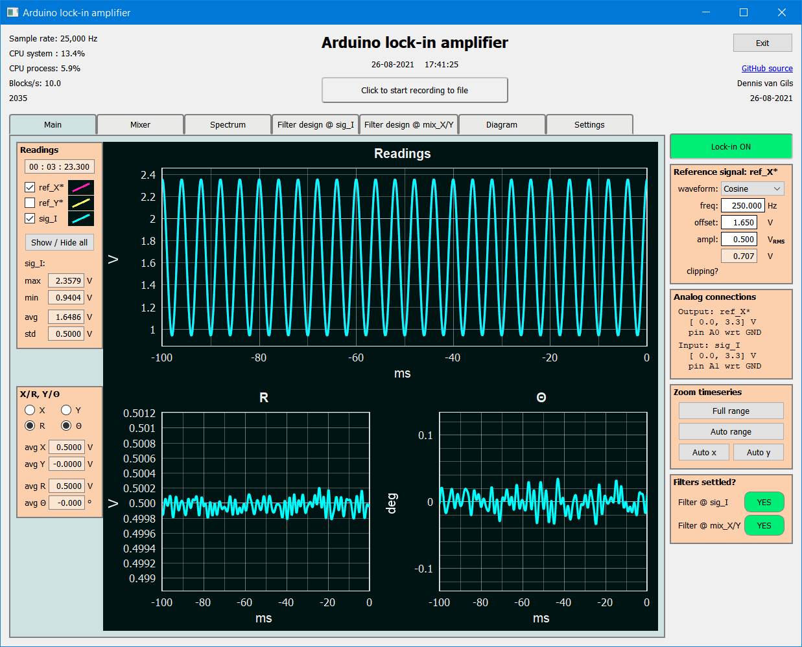
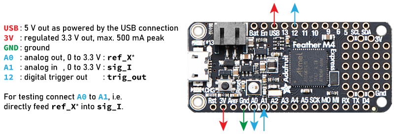

.. image:: https://img.shields.io/github/v/release/Dennis-van-Gils/DvG_Arduino_lock-in_amp
    :alt: Latest release
.. image:: https://img.shields.io/github/last-commit/Dennis-van-Gils/DvG_Arduino_lock-in_amp
    :alt: Last commit
.. image:: https://requires.io/github/Dennis-van-Gils/DvG_Arduino_lock-in_amp/requirements.svg?branch=master
    :target: https://requires.io/github/Dennis-van-Gils/DvG_Arduino_lock-in_amp/requirements/?branch=master
    :alt: Requirements
.. image:: https://img.shields.io/badge/code%20style-black-000000.svg
    :target: https://github.com/psf/black
    :alt: Code style: Black
.. image:: https://img.shields.io/badge/License-MIT-purple.svg
    :target: LICENSE.txt
    :alt: MIT License
    
    
DvG Arduino lock-in amplifier
=============================

This project concerns a fully fledged lock-in amplifier running on an
Atmel SAMD21 (Arduino M0/M0 Pro) or SAMD51 (Adafruit
Metro/Feather/ItsyBitsy M4 Express) microcontroller board in combination
with a PC running Python for the graphical user interface.

The Arduino microcontroller will generate the reference signal
``REF_X*`` and subsequently acquires the input signal ``SIG_I``. This
data is sent over USB to a PC running the graphical user interface in
Python. The interface shows the waveform graphs of the signals in
real-time, performs the heterodyne mixing and filtering of the signals
similar to a lock-in amplifier, and provides logging to disk.

|Screenshot| See `here <screenshots/>`__ for more screenshots.

User manual
~~~~~~~~~~~

A `user manual <user_manual/DvG_ALIA_Student_user_manual.pdf>`__ with
detailed installation instructions and troubleshooting is provided. It
is part of the lab assignments 'Small Signals & Detection' of the
University of Twente, Enschede, The Netherlands.

Specifications
~~~~~~~~~~~~~~

Microcontroller:

-  Support for Atmel SAMD21 or SAMD51 chipsets
-  The ADC & DAC operate at sampling rates of 20 kHz and above
-  True analog-out waveform generator (``REF_X*`` between 0 to 3.3 V)
-  Two modes available for the analog-in data acquisition. Determined by
   a flag set in the firmware:

   -  Single-ended (``SIG_I`` between 0 to 3.3 V), default
   -  Differential (``SIG_I`` between -3.3 to 3.3 V)

-  Double-buffered binary-data transmission over USB

Python graphical user interface:

-  Separate threads for communication with the Arduino, signal
   processing and graphing
-  Accelerated mathematical operations based on
   `pyFFTW <https://pyfftw.readthedocs.io/en/latest/>`__,
   `Numba <https://numba.pydata.org/>`__ and
   `SciPy <https://scipy.org/>`__
-  OpenGL hardware-accelerated graphing
-  Zero-phase distortion FIR filters
-  Scans over all serial ports to automatically connect to the Arduino
-  Tested under Windows 10 and Ubuntu 18.04.2 (Linux)

Prerequisites
~~~~~~~~~~~~~

| Python 3.8
| Preferred distribution: Anaconda full or Miniconda

Installation instructions in Anaconda Prompt:

::

   conda update -n base -c defaults conda
   conda create -n lia -c conda-forge  --force -y python=3.8.10
   conda activate lia
   pip install -r requirements.txt

Now you can run the graphical user interface of the lock-in amplifier.
In Anaconda prompt:

::

   conda activate lia
   ipython DvG_Arduino_lockin_amp.py

Precompiled firmware
~~~~~~~~~~~~~~~~~~~~

I provide several precompiled firmware that can be flashed straight onto
the microcontroller board of your choice. This eliminates the need to
compile the code for yourself. They can be found in the
`mcu_firmware </mcu_firmware>`_
folder. See the table below for suggested firmware to use best. For
other boards you'll have to compile the code yourself.

+-------------------------+-------------------------+---------------+
| Board                   | Firmware                | Sampling rate |
+=========================+=========================+===============+
| Arduino M0 Pro          | \\v1.0.0_V              | 10 kHz        |
|                         | SCODE\mzeropro__10kHz\\ |               |
+-------------------------+-------------------------+---------------+
| Arduino M0 Pro          | \\v1.0.0_MICROCHIPS     | 20 kHz        |
|                         | TUDIO\mzeropro__20kHz\\ |               |
+-------------------------+-------------------------+---------------+
| Adafruit Feather M4     | \\v1.0.0_VSCODE\adafr   | 25 kHz        |
| Express                 | uit_feather_m4__25kHz\\ |               |
+-------------------------+-------------------------+---------------+

Flashing firmware onto the Adafruit M4 board is super easy. Simply copy
over the file
`CURRENT.UF2 <https://github.com/Dennis-van-Gils/DvG_Arduino_lock-in_amp/raw/master/mcu_firmware/v1.0.0_VSCODE/adafruit_feather_m4__25kHz/CURRENT.UF2>`_
to the FEATHERBOOT mount drive.

Pin-out
~~~~~~~

For the case of an Adafruit Feather M4 Express board, see below. Other
boards have a similar pin-out. |pinout|

The provided precompiled firmware defaults to single-ended ADC, meaning
``sig_I`` is measured with respect to ``GND``. You can adjust the flag
``ADC_DIFFERENTIAL`` in the ``main.cpp`` source code and recompile to
switch to differential mode.

::

       `ADC_DIFFERENTIAL = 0`, default
       ------------------------------------------
       - A1: analog in,   0 to 3.3 V, sig_I with respect to GND
       - A2: not used

       `ADC_DIFFERENTIAL = 1`
       ------------------------------------------
       - A1: analog in, -3.3 to 3.3 V, sig_I(+)
       - A2: analog in, -3.3 to 3.3 V, sig_I(-)

Dennis van Gils, 03-02-2022

