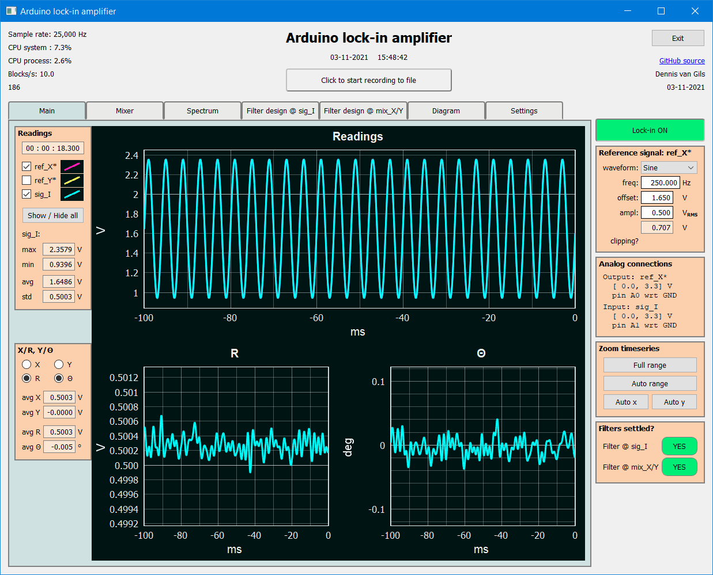

.. image:: https://img.shields.io/github/v/release/Dennis-van-Gils/DvG_Arduino_lock-in_amp
    :target: https://github.com/Dennis-van-Gils/DvG_Arduino_lock-in_amp
    :alt: Latest release
.. image:: https://img.shields.io/github/last-commit/Dennis-van-Gils/DvG_Arduino_lock-in_amp
    :target: https://github.com/Dennis-van-Gils/DvG_Arduino_lock-in_amp
    :alt: Last commit
.. image:: https://img.shields.io/badge/code%20style-black-000000.svg
    :target: https://github.com/psf/black
    :alt: Code style: Black
.. image:: https://img.shields.io/badge/License-MIT-purple.svg
    :target: LICENSE.txt
    :alt: MIT License

DvG Arduino lock-in amplifier
=============================

A fully fledged lock-in amplifier running at a 25 kHz sampling rate at 12-bit
analog resolution with an extensive graphical user interface showing
real-time signals, interactive filter design and real-time power spectra.

The project is part of the lab assignments 'Small Signals & Detection' of the
University of Twente, Enschede, The Netherlands. A
`user manual <user_manual/DvG_ALIA_Student_user_manual.pdf>`__
with detailed installation instructions and troubleshooting is provided. This
lock-in amplifier can very well be used for scientific research in the lab.

It consists of a PC/laptop running Python for the graphical user interface and
signal post-processing in combination with a microcontroller board for the
phase-locked signal generation and acquisition. The preffered microcontroller is
an Atmel SAMD51 microprocessor (e.g. an Adafruit M4 Express board like the
Feather or ItsyBitsy), but support for the slower Atmel SAMD21 microprocessor is
also provided (e.g. an Arduino M0 Pro).

|Screenshot| See `here <screenshots/>`__ for more screenshots.

Specifications
~~~~~~~~~~~~~~

The microcontroller will generate the reference signal ``REF_X*`` and
subsequently acquires the input signal ``SIG_I``. This data is sent over USB to
a PC running the graphical user interface in Python. The interface shows the
waveform graphs of the signals in real-time, performs the heterodyne mixing and
filtering of the signals (i.e. the lock-in technique), and provides logging to
disk.

Microcontroller:

-  Support for Atmel SAMD21 or SAMD51 chipsets
-  The ADC & DAC are locked in phase and operate at sampling rates of 20 kHz and above
-  True analog-out waveform generator (``REF_X*`` between 0 to 3.3 V)
-  Two modes available for the analog-in data acquisition. Determined by
   a flag set in the firmware:

   -  Single-ended (``SIG_I`` between 0 to 3.3 V), default
   -  Differential (``SIG_I`` between -3.3 to 3.3 V)

-  Optimized data transmission over USB (double-buffered binary-data stream)

Python program:

-  Graphical user interface
-  Separate threads for communication with the Arduino, signal
   processing and graphing
-  Accelerated mathematical operations based on
   `pyFFTW <https://pyfftw.readthedocs.io/en/latest/>`__,
   `Numba <https://numba.pydata.org/>`__ and
   `SciPy <https://scipy.org/>`__
-  OpenGL hardware-accelerated graphing
-  Zero-phase distortion FIR filters
-  Automatically connects to the Arduino by scanning over all ports
-  Tested under Windows 10 and Ubuntu 18.04.2 (Linux)

Prerequisites
~~~~~~~~~~~~~

| Python 3.8+
| Preferred distribution: Anaconda full or Miniconda

Installation instructions in Anaconda Prompt:

::

   conda update -n base -c defaults conda
   conda create -n lia -c conda-forge  --force -y python=3.8.10
   conda activate lia
   pip install -r requirements.txt

Now you can run the graphical user interface of the lock-in amplifier.
In Anaconda prompt:

::

   conda activate lia
   ipython DvG_Arduino_lockin_amp.py

Precompiled firmware
~~~~~~~~~~~~~~~~~~~~

I provide several precompiled firmware that can be flashed straight onto
the microcontroller board of your choice. This eliminates the need to
compile the code for yourself. They can be found in the
`mcu_firmware </mcu_firmware>`_
folder. See the table below for suggested firmware to use best. For
other boards you'll have to compile the code yourself.

+---------------------+---------------------------------------------+---------------+
| Board               | Firmware folder: \\mcu_firmware             | Sampling rate |
+=====================+=============================================+===============+
| Arduino M0 Pro      | \\v1.0.0_VSCODE\\mzeropro__10kHz            | 10 kHz        |
+---------------------+---------------------------------------------+---------------+
| Arduino M0 Pro      | \\v1.0.0_MICROCHIPSTUDIO\\mzeropro__20kHz   | 20 kHz        |
+---------------------+---------------------------------------------+---------------+
| Adafruit Feather M4 | \\v1.0.0_VSCODE\\adafruit_feather_m4__25kHz | 25 kHz        |
| Express (preferred) |                                             |               |
+---------------------+---------------------------------------------+---------------+

Flashing firmware onto the Adafruit M4 board is super easy. Simply copy
over the file
`CURRENT.UF2 <https://github.com/Dennis-van-Gils/DvG_Arduino_lock-in_amp/raw/master/mcu_firmware/v1.0.0_VSCODE/adafruit_feather_m4__25kHz/CURRENT.UF2>`_
to the FEATHERBOOT mount drive.

Pin-out
~~~~~~~

For the case of an Adafruit Feather M4 Express board, see below. Other
boards have a similar pin-out. |pinout|

The provided precompiled firmware defaults to single-ended ADC, meaning
``sig_I`` is measured with respect to ``GND``. You can adjust the flag
``ADC_DIFFERENTIAL`` in the ``main.cpp`` source code and recompile to
switch to differential mode.

::

       `ADC_DIFFERENTIAL = 0`, default
       ------------------------------------------
       - A1: analog in,   0 to 3.3 V, sig_I with respect to GND
       - A2: not used

       `ADC_DIFFERENTIAL = 1`
       ------------------------------------------
       - A1: analog in, -3.3 to 3.3 V, sig_I(+)
       - A2: analog in, -3.3 to 3.3 V, sig_I(-)

Dennis van Gils, 03-02-2022

